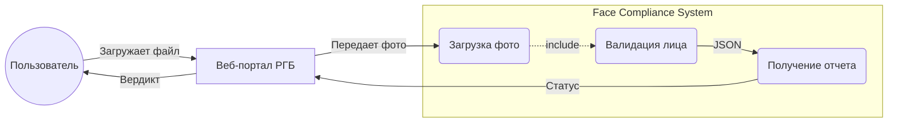
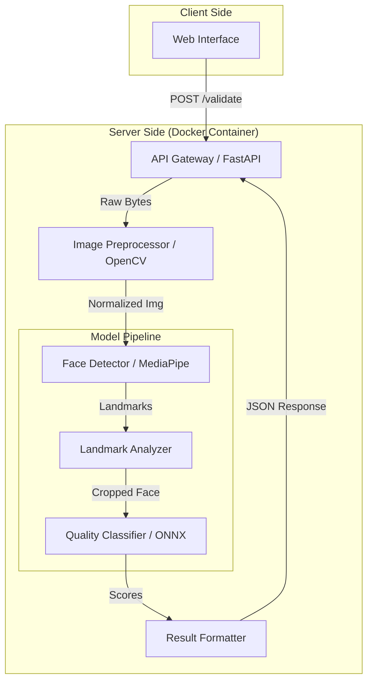
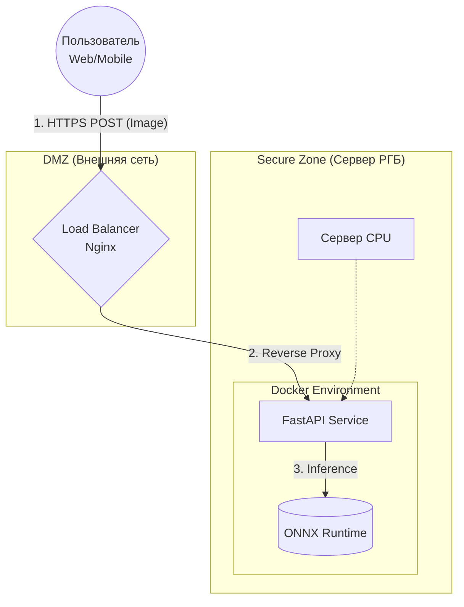

# Задание 4: Архитектура и выбор инструментов

**Проект:** Проверка корректности фотографии лица пользователя при регистрации.

## 1. Обоснование выбора подхода 

Для решения задачи выбран **Гибридный подход**, комбинирующий легковесные нейросетевые детекторы и методы классического компьютерного зрения.

### Критерии выбора:
1.  **Ресурсы:**
    *   Инференс на CPU.
    *   Поэтому отказ от тяжелых моделей (ViT, ResNet-101) в пользу мобильных архитектур (MobileNetV3, ShuffleNet). Использование **ONNX Runtime** для ускорения CPU-инференса.
2.  **Задержка:**
    *   Время ответа < 1.5 сек.
    *   Поэтому использование **MediaPipe** для геометрических проверок (оно работает быстрее, чем прогон картинки через тяжелую CNN) + каскадная структура (если лица нет, то сразу отказ, не запуская проверку качества).
3.  **Данные:**
    *   Отсутствие реальных данных плохого качества.
    *   Поэтому использование предобученных моделей (Pre-trained) с дообучением (Fine-tuning) только финальных слоев на синтетике.

**Итоговый выбор:**
*   **Детекция и Геометрия:** MediaPipe Face Mesh.
*   **Качество и Атрибуты:** MobileFaceNet / EfficientNet-Lite (конвертированные в ONNX).
*   **Препроцессинг:** OpenCV.

---

## 2. UML Архитектура

### 2.1. Диаграмма прецедентов
Кто и как взаимодействует с системой.

### 2.2. Диаграмма компонентов
Внутреннее устройство пайплайна обработки.

---

## 3. Инструменты и Стек 

### 3.1. Язык и Фреймворки
*   **Язык:** Python 3.9+ 
*   **Web API:** **FastAPI** + **Pydantic**.
    *   Асинхронность позволяет эффективно обрабатывать параллельные запросы I/O, автоматическая генерация документации (Swagger).
*   **Containerization:** **Docker**.
    *   Изоляция окружения, гарантия воспроизводимости.

### 3.2. Обучение и Инференс
В архитектуре предусмотрено разделение сред обучения и исполнения:

*   **Training Framework:** **PyTorch**.
    *   Используется для экспериментов, обучения и Fine-tuning моделей.
    *   Преимущества: Динамический граф вычислений, огромная экосистема SOTA-моделей.
*   **Inference Engine (CPU):** **ONNX Runtime**.
    *   Модели экспортируются из PyTorch в формат `.onnx`.
    *   ONNX Runtime обеспечивает оптимизацию графа вычислений и использование векторных инструкций процессора (AVX2/AVX-512), что снижает Latency на CPU по сравнению с сырым PyTorch. Также это уменьшает размер Docker-образа (нет необходимости тянуть тяжелые зависимости CUDA/Torch).
*   **Data Processing:** **NumPy** и **OpenCV**.

### 3.3. Альтернативный сценарий 
В случае масштабирования системы или появления доступа к GPU-ускорителям, архитектура допускает замену Inference Engine:

**Сценарий GPU:**
*   **Engine:** PyTorch или TensorRT.
*   **Преимущества:** Значительное ускорение (в 10-50 раз) за счет параллелизма CUDA.
*   **Изменения:** В `docker-compose` заменяется базовый образ на `pytorch/pytorch:cuda-runtime`. Код инференса меняет бэкенд одной строкой конфигурации (`device = 'cuda'`).

### 3.4. Деплой 
Схема развертывания в инфраструктуре заказчика (CPU).

---

## 4. Этические и технические меры 

1.  **Без сохранения состояния:**
    *   Сервис не подключен к базе данных для хранения изображений.
    *   Жизненный цикл фото: `Request` -> `RAM Processing` -> `Verdict` -> `RAM Clear`.
2.  **Конфиденциальность:**
    *   В логи пишутся только метаданные: `timestamp`, `processing_time`, `verdict` (например, "rejected: glasses").
    *   **Запрещено:** Писать в логи сами изображения (base64) или персональные идентификаторы.
3.  **Снижение предвзятости:**
    *   Использование метрики сбалансированной точности при обучении, чтобы система одинаково хорошо работала на людях разного пола и этнической принадлежности (обеспечивается разнообразием датасета FFHQ/CelebA).